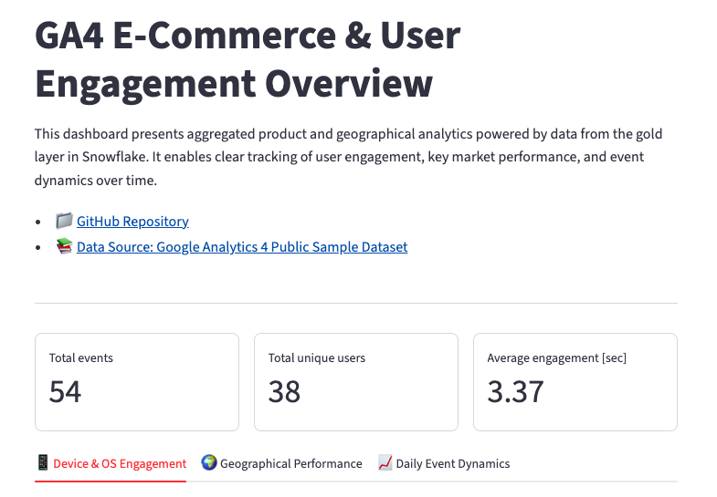
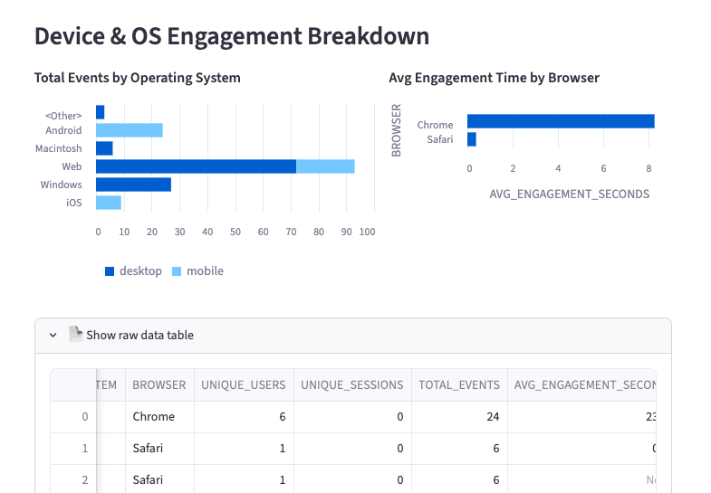
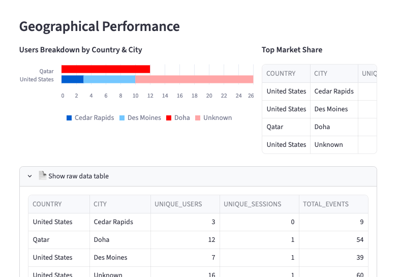
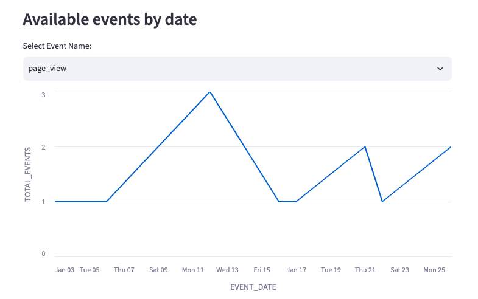
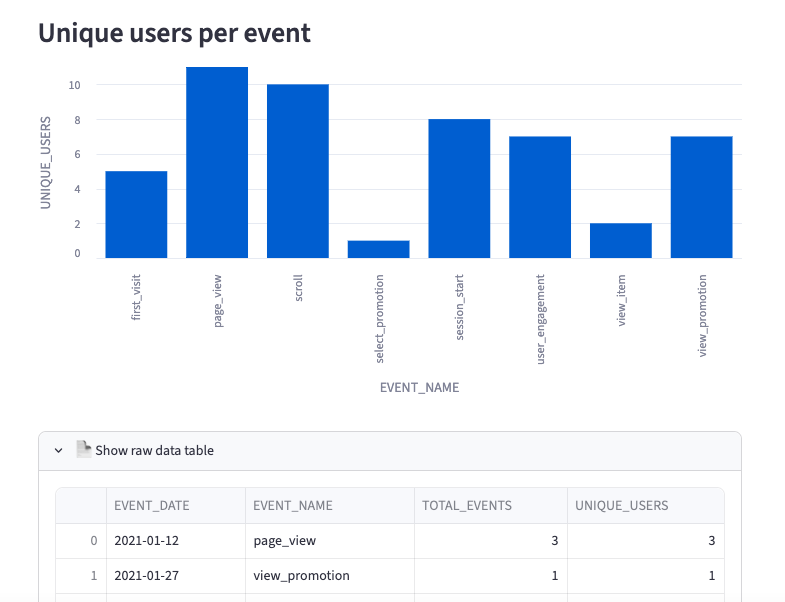

# GA4 Snowflake & Streamlit Data Pipeline

🚀 [Live Production Dashboard](https://app-app-pipeline-xkza5jvemrqjel6s93ldet.streamlit.app/)

A comprehensive data pipeline project leveraging Snowflake for data warehousing and Streamlit for interactive analytics. This project processes Google Analytics 4 (GA4) sample data to provide actionable insights into user engagement, device distribution, and geographical performance.

---

## Data Engineering & Dimensional Modeling

### 1. Medallion Architecture Steps
* **Raw Ingestion (`GA4_RAW_EVENTS`)**: Staging raw event logs directly from the Google Analytics 4 dataset.
* **Silver Layer (Dimensional Modeling)**:
  * Designed a **Star Schema** separating fact event records from device/demographic attributes.
  * Generated **Surrogate Keys** using `MD5` hashing on composite attributes (`MD5(CONCAT_WS(...))`) to construct unique, deterministic identifiers (`device_id` and `event_id`).
  * Enforced relational integrity via Foreign Key constraints.
* **Gold Layer (Analytics Views)**:
  * Pre-calculated aggregated business metrics into optimized SQL views for high-performance frontend queries.

### 2. Data Model Schema

#### Tables (Silver Layer)

| Table / Entity | Primary / Foreign Key | Description |
| :--- | :--- | :--- |
| **`DIM_DEVICES`** | `device_id` (PK) | Dimension table storing unique device categories, operating systems, browsers, countries, and cities. |
| **`FACT_EVENTS`** | `event_id` (PK), `device_id` (FK) | Fact table storing individual event instances, session IDs, event dates, event names, and engagement durations. |

#### Views (Gold Layer)

| View Name | Description |
| :--- | :--- |
| **`DEVICE_ENGAGEMENT`** | Aggregates unique users, unique sessions, total events, and average engagement time per OS and browser. |
| **`GEO_PERFORMANCE`** | Summarizes traffic, session counts, and user metrics aggregated by country and city. |
| **`DAILY_EVENT_SUMMARY`** | Aggregates event volume and unique user dynamics over time. |
| **`OVERALL_KPI_SUMMARY`** | Calculates top-level metrics (Total Events, Unique Users, Avg Engagement Seconds) for dashboard KPI cards. |

---

## Technologies Used
* **Data Warehouse**: Snowflake (`ANALYTICS_PROD` database, `GOOGLE_ANALYTICS` schema)
* **Data Modeling & ETL/ELT**: SQL (DDL, DML, Window Functions, MD5 Hashing, Relational Integrity)
* **Frontend & Visualization**: Python, Streamlit, Pandas, Native Streamlit Charts (`st.bar_chart`, `st.line_chart`)
* **Config & Deployment**: Streamlit Community Cloud, `st.connection("snowflake")`, Secrets Management

---

## Dashboard Walkthrough

The Streamlit application queries the Snowflake Gold views in real-time, offering a clean, tabbed analytical dashboard.

### Top-Level Overview & KPI Summary
Upon launching the dashboard, top-level metric cards display high-level aggregated summary statistics straight from the `OVERALL_KPI_SUMMARY` view.



---

### Tab 1: Device & OS Engagement
Here, user traffic and platform interaction are broken down across different hardware and software ecosystems:
* **Stacked Bar Chart**: Visualizes total events categorized by Operating System and split by Device Category (`desktop` vs `mobile`).
* **Browser Performance Chart**: Analyzes average engagement time (seconds) per web browser.
* **Raw Data Table**: Expandable raw dataset for further audit.



---

### Tab 2: Geographical Performance
This section maps global audience reach and regional density:
* **Users Breakdown by Country & City**: Stacked visualization showing city-level user breakdown across top markets.
* **Top Market Share Table**: Ranked tabular breakdown of unique users across key geographical locations.



---

### Tab 3: Daily Event Dynamics
Focuses on tracking user actions over time:
* **Interactive Event Selector**: Allows users to filter specific GA4 events (e.g., `page_view`, `session_start`) to inspect their trend line over time.



* **Event Popularity Bar Chart**: Ranks overall events based on the total volume of unique participating users.



---

## Troubleshooting Cloud Deployment

If you encounter an `expired token` or database connection error when accessing the deployed dashboard on Streamlit Cloud, check the following configuration settings:

1. **Snowflake Session Timeout**: The app utilizes `st.connection("snowflake")`. If the database credentials or session tokens provided in the cloud environment expire, the platform cannot refresh the pool.
2. **Environment Secrets**: Ensure your production parameters (`account`, `user`, `password`, `database`, `schema`) are exactly mapped into the **Secrets** section within your Streamlit Cloud management settings.
3. **To Fix**: Navigate to your app workspace settings on Streamlit Cloud, open the **Secrets** dashboard, verify credential validity, and trigger an explicit app reboot to re-initialize your connection parameters.

---

## Professional Highlights

* **Dimensional Data Modeling**: Implemented Star Schema design with surrogate keys using deterministic MD5 hashes for clean join performance.
* **Separation of Concerns**: Kept business logic in the warehouse layer via Snowflake Views, minimizing runtime computation in Python.
* **Cloud-Native Deployment**: Hosted on Streamlit Cloud with secure connection secrets and optimized session caching (`ttl`).

---

## Setup & Installation

### 1. Snowflake Warehouse Configuration
Execute the SQL scripts in your Snowflake console in the following order to build the warehouse structure and populate data:

1. Run **`sql/01_silver_ga4_ddl.sql`** to initialize the context, database, schemas, and empty relational tables.
2. Run **`sql/02_silver_ga4_dml.sql`** to trigger the ETL/ELT process that transforms the raw logs and generates MD5 surrogate keys.
3. Run **`sql/03_gold_ga4_views.sql`** to build the Gold Layer views optimized for direct dashboard consumption.

### 2. Local Environment Setup
Clone the repository and install the Python dependencies:

```bash
git clone https://github.com
cd snowflake-streamlit-pipeline

python -m venv venv
source venv/bin/activate  # On Windows: venv\Scripts\activate

pip install -r requirements.txt
```

### 3. Connection Configuration
Create a `.streamlit` directory inside the project root and define your database credentials inside a `secrets.toml` file:

```toml
# .streamlit/secrets.toml
[connections.snowflake]
account = "your_snowflake_account_locator"
user = "your_username"
password = "your_password"
role = "your_role"
warehouse = "your_warehouse"
database = "ANALYTICS_PROD"
schema = "GOOGLE_ANALYTICS"
client_session_keep_alive = true
```
Snowflake account identifier must use the format `organization-account`. You can extract these two values directly from your Snowsight URL: `https://snowflake.com`.

### 4. Run the Application
Launch the local instance of the dashboard:
```bash
streamlit run streamlit_app.py
```
